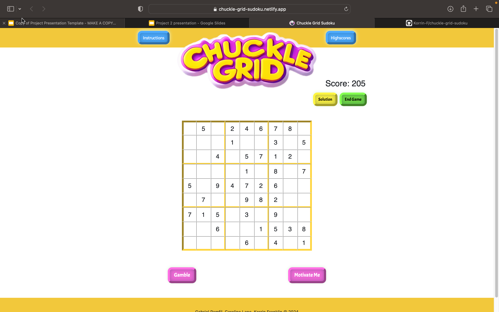
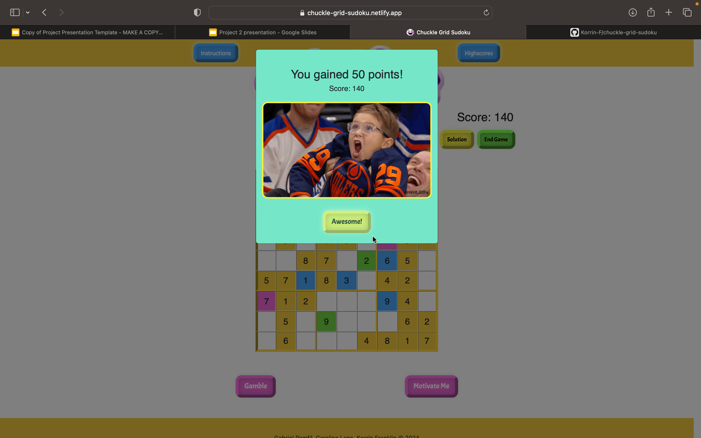

# Chuckle Grid Sudoku

         

### Contact Information

#### Caroline 

- **GitHub:** [Cazbella](https://github.com/Cazbella)
- **LinkedIn:** [Caroline-Lane](https://www.linkedin.com/in/caroline-lane7/) 

#### Korrin

- **GitHub:** [Korrin-F](https://github.com/Korrin-F)
- **LinkedIn:** [korrin-franklin](https://www.linkedin.com/in/korrin-franklin/) 

#### Gabriel

- **GitHub:** https://github.com/M4r1aN24
- **Email:** https://www.linkedin.com/in/gabriel-pamfil-28a449236/

## Table of Contents
- [Description](#description)
- [Installation](#installation)
- [Usage](#usage)
- [Contributing](#contributing)
- [Questions](#questions)

## Description

Find the deployed application here: 

https://chuckle-grid-sudoku.netlify.app/game

Introducing Chuckle Grid, your go-to Sudoku app with a delightful twist! Unlike ordinary Sudoku games, Chuckle Grid adds a dash of humor and excitement to your puzzling experience. Take a chance with the Gamble button for a shot at bonus points, a point deduction, or revealing tiles. 

Need a boost? Hit the Motivation button for a dose of laughter with amusing memes or GIFs. And here's the cherry on top – each button comes with its own hilarious sound effect, making your Sudoku sessions not only challenging but downright entertaining. 

Record your high scores to see your progress and play over and over again!

Get ready to chuckle your way through Sudoku like never before!

# User Story

AS a Sudoku Enthusiast,
I WANT to play my favourite game with more functionality.
SO THAT,  I can satisfy my desire to experience new kinds of Sudoku.

Features:
- Colourful sudoku game with extra features.
- Responsive Design: The game can be played on any size screen.
- Sound effects on buttons and changing gifs for interest.
- A high scores page to record and compare your scores (with cool music at the end!).
- Play the game at 3 different levels.

### Motivation

The motivation behind this project was to create a Sudoku game that could also be entertaining.

### Challenges

It was a challenge to map the api result to the grid. The api was also tempremental at times! Getting to grips with state was important for the sounds and we still have improvements to make here. 

## Installation
Installation:
1. Clone the repository: git clone https:
2. Navigate to the project directory: cd react-portfolio
3. Install dependencies: npm install
4. Start the development server: npm start

Visit http://localhost:<#number> to view the app in your browser.

**Dependencies:**

  "dependencies": {
    "@popperjs/core": "^2.11.8",
    "axios": "^1.6.5",
    "bootstrap": "^5.3.2",
    "howler": "^2.2.4",
    "react": "^18.2.0",
    "react-bootstrap": "^2.10.0",
    "react-dom": "^18.2.0",
    "react-modal": "^3.16.1",
    "react-router-dom": "^6.21.3",
    "use-sound": "^4.0.1"
  },
  "devDependencies": {
    "@types/react": "^18.2.43",
    "@types/react-dom": "^18.2.17",
    "@vitejs/plugin-react": "^4.2.1",
    "eslint": "^8.55.0",
    "eslint-plugin-react": "^7.33.2",
    "eslint-plugin-react-hooks": "^4.6.0",
    "eslint-plugin-react-refresh": "^0.4.5",
    "vite": "^5.0.8"
  }

## Usage

Upon loading you can click on 'Home' and see the home page, as shown below. 

Here you can choose your difficulty and also 'set your motivation' - you will see how this is used on the next screen!

Type your numbers within the tiles. If you want to gamble, press the gamble button! You may lose points though, as shown below!

The motivation gives you some motivation based on the input from the home screen. 

You can save your score and it will display on the high scores page

## Contributing
Contributions to this project are welcome and encouraged! If you have ideas for new features, find a bug, or want to improve the documentation, feel free to contribute. To contribute to the project fork the repository on GitHub. Clone your forked repository to your local machine. Create a new branch with a descriptive name for your contribution: git checkout -b feature/new-feature or git checkout -b bug/fix-bug. Then make your changes and commit them with a clear message. Push your changes to your forked repository and open a pull request in the main repository with a detailed description of your changes. Please follow the project's coding style and adhere to the existing conventions. By contributing, you agree that your contributions will be licensed under the project's license. Thank you for helping make our project better!
